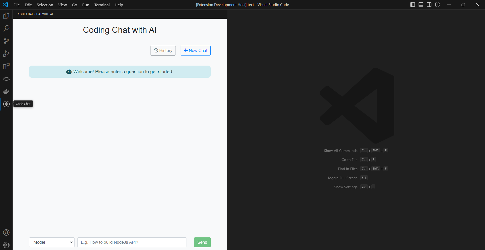
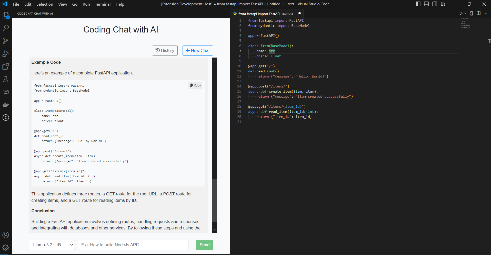
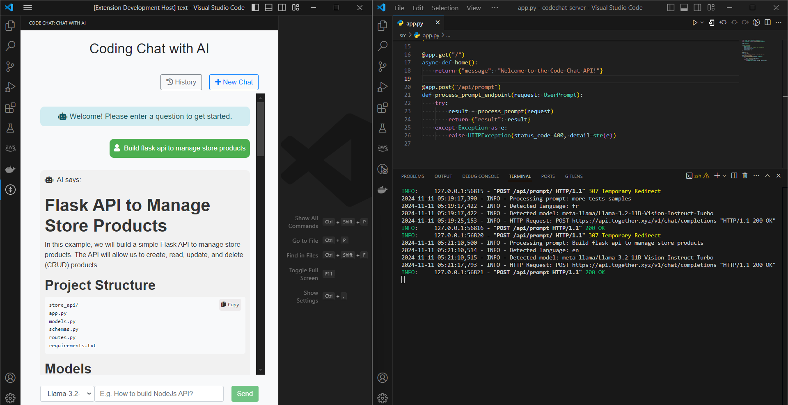
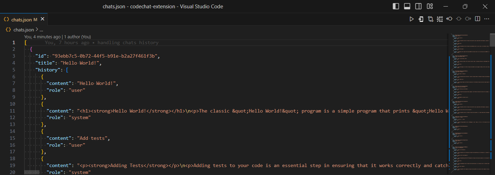
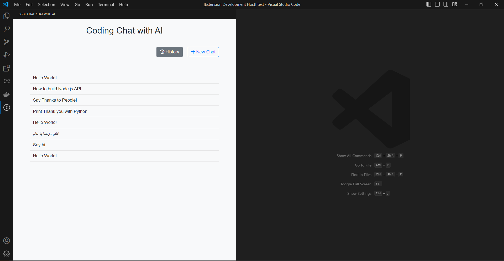
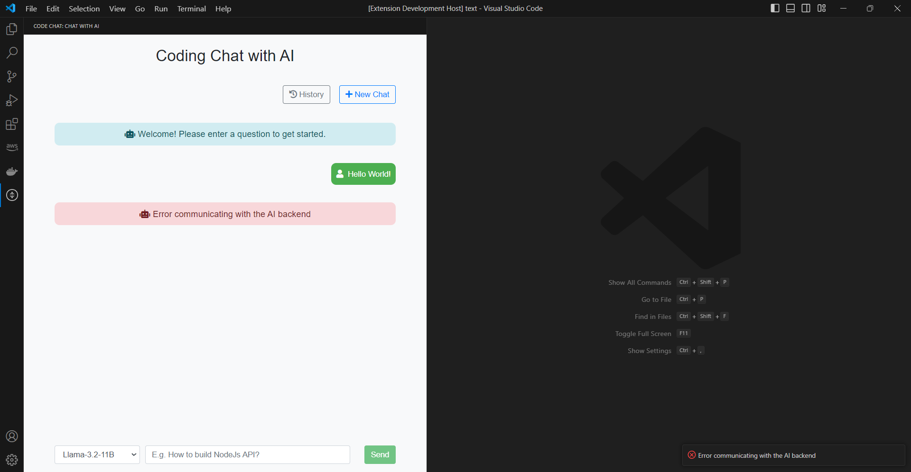
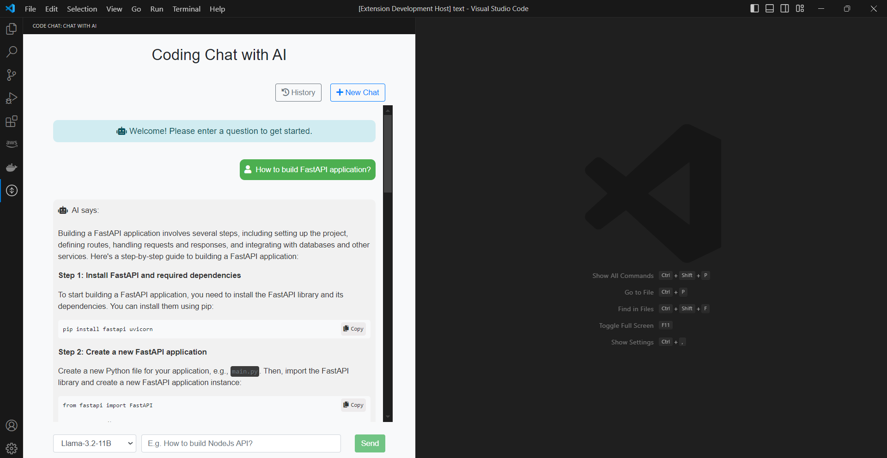

# Code Chat

Code Chat is a Visual Studio Code extension backed by a FastAPI server, providing AI-driven coding assistance tailored to the user's language.

## Code Chat Extension

The **Code Chat Extension** integrates with a FastAPI backend to offer natural language processing (NLP) for coding-related queries using Together AI’s Llama models. It allows developers to interact with AI directly in VS Code, simplifying tasks like code completion, debugging, and general coding queries.

### Key Features

- **Native Language Support**: Communicate in your preferred language; Code Chat responds accordingly.
- **Multiple AI Models**: Access a range of powerful models:
  - **Llama-3.2-11B** for versatile knowledge
  - **Meta-Llama-3.1-8B** for faster performance
  - **CodeLlama-34B** for code-specific support
- **Chat History**: Keep past conversations accessible.
- **Interactive Sidebar**: Initiate chats, review history, and manage saved conversations from a convenient sidebar.
- **Copy Code**: Easily copy AI-generated code snippets to your clipboard.

### Commands

- **Hello** (`codechat.helloWorld`): Displays a welcome message.
- **Start Code Chat** (`codechat.startChat`): Begins a new chat session with the AI.

---

## Code Chat Server

The **Code Chat Server** is a FastAPI backend powering the Code Chat extension. It processes user queries, communicates with Llama models, detects language automatically, and returns context-aware responses.

### Key Features

- **Integration with Together AI’s Llama Models**: Uses models such as Llama-3.2-11B, Meta-Llama-3.1-8B, and CodeLlama-34B.
- **Language Detection**: Identifies and responds in the user's language.
- **Real-Time AI Responses**: Processes requests efficiently for minimal delay.
- **Scalable Design**: Supports multiple simultaneous requests with low latency.

## Screenshots

Explore more features through these screenshots:

- **Chat Box**  
  

- **Chats History File**  
  

- **Chats History**  
  

- **Sending Request**  
  

- **Error Message**  
  

- **Response**  
  
