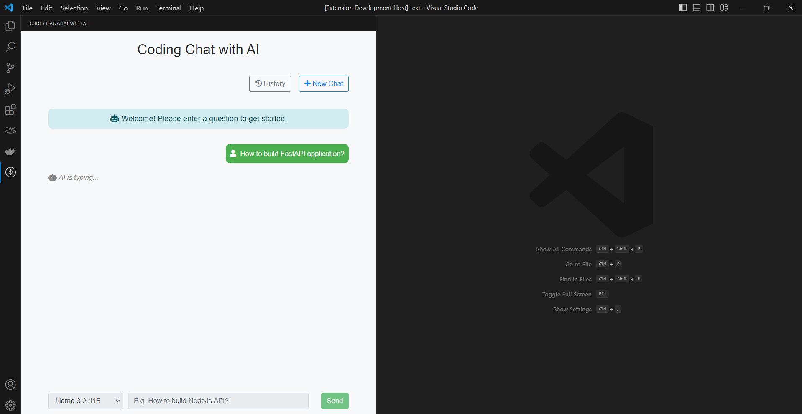

# Code Chat

## Code Chat Extension

Code Chat is a Visual Studio Code extension that integrates with a FastAPI backend, utilizing Together AI's Llama models to enable natural language processing (NLP) for coding-related queries. The extension allows developers to interact with AI directly within VS Code, streamlining tasks like code completion, debugging assistance, and general coding inquiries.

### Features

- **Native Language Support**: Interact with the AI in your preferred language, and Code Chat will respond in kind.
- **Multiple AI Models**: Select from a range of powerful Llama models integrated with **TogetherAI** via **Code Chat Server**, including:
  - **Llama-3.2-11B** for comprehensive knowledge and versatility
  - **Meta-Llama-3.1-8B** for faster performance
  - **CodeLlama-34B** for enhanced code-specific support
- **Chat History**: Keep track of past conversations for easy reference.
- **Interactive Sidebar**: Code Chat appears as a sidebar where you can initiate chats, review history, and access saved conversations.
- **Copy Code Functionality**: Easily copy AI-generated code snippets to your clipboard for quick integration.

### Commands

- **Hello** (`codechat.helloWorld`): Displays a simple greeting message.
- **Start Code Chat** (`codechat.startChat`): Opens a new chat session with the AI.

---

## Code Chat Server

The **Code Chat Server** is a FastAPI-based backend that powers the Code Chat extension. It handles user prompts, interacts with Together AI’s Llama models, detects the language of incoming prompts, and returns appropriate responses.

### Features
- **Integration with Together AI’s Llama Models**: Includes Llama-3.2-11B, Meta-Llama-3.1-8B, CodeLlama-34B, and others.
- **Language Detection**: Automatically detects the language of the user’s input and processes the request accordingly.
- **AI Model Communication**: Interacts with the models through API calls, enabling real-time, context-aware responses.
- **Scalable and Efficient**: Designed to handle multiple simultaneous requests, ensuring minimal latency during interactions.

## Screenshots

Here are additional screenshots demonstrating the features of Code Chat:

- **Chat Box**:  
  

- **Chats History File**:  
  

- **Chats History**:  
  

- **Sending Request**:  
  

- **Error Message**:  
  

- **Response**:  
  
